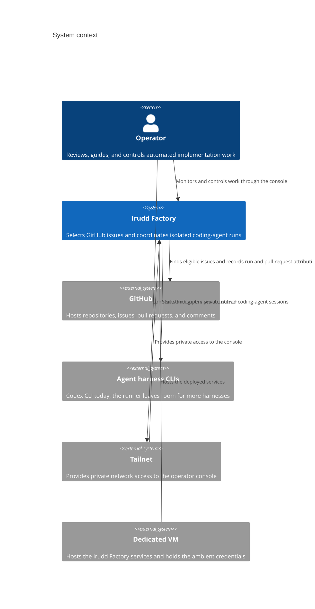
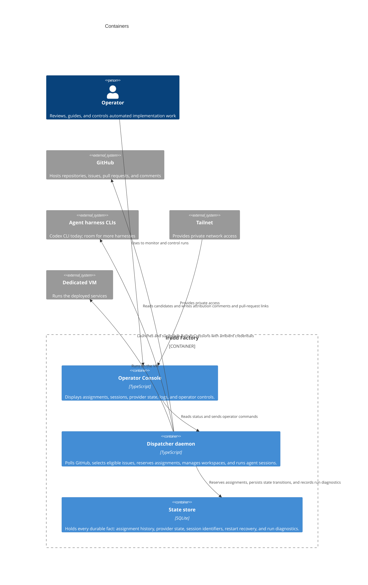
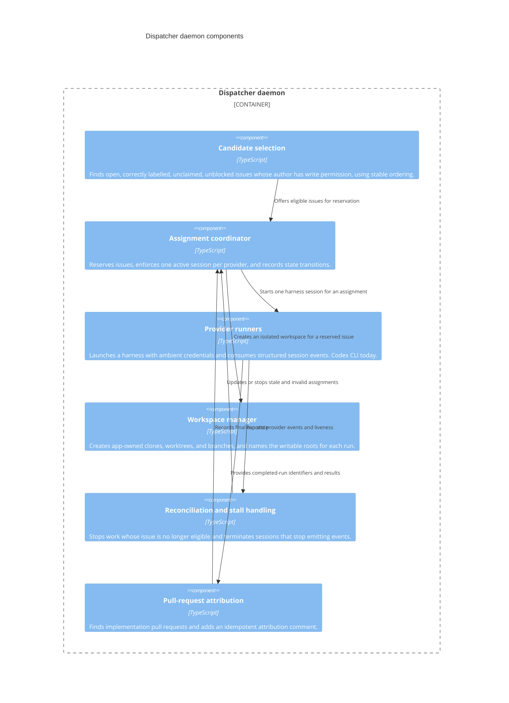

# Architecture: high-level components

Irudd Factory is a TypeScript service on one dedicated VM. It watches
configured GitHub repositories, selects eligible issues, creates isolated
per-issue workspaces, and runs coding-agent sessions in them. A tailnet-served
console lets the single operator monitor and control that work.

Codex CLI is the only harness today. The provider runner is a seam, so room is
left for more harnesses later.

Three rules shape the design and appear in every layer below:

- Only issues whose author has write permission to the repository are eligible.
- `gh` and Codex run with the operator's ambient credentials; the service
  mints, injects, and stores no tokens.
- Writable roots are the containment: an agent writes only to its workspace and
  that workspace's `.git` directory. Reads are unrestricted on the VM.

The trades these imply are recorded in
[SECURITY-LIMITATIONS.md](../../SECURITY-LIMITATIONS.md). The technology choices and
conventions behind these components are in [stack.md](../stack.md).

## System context

## Containers

## Dispatcher components

