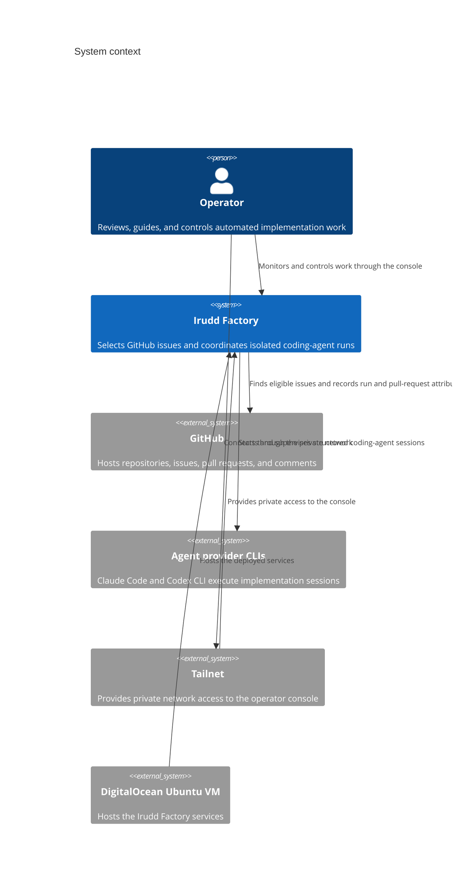
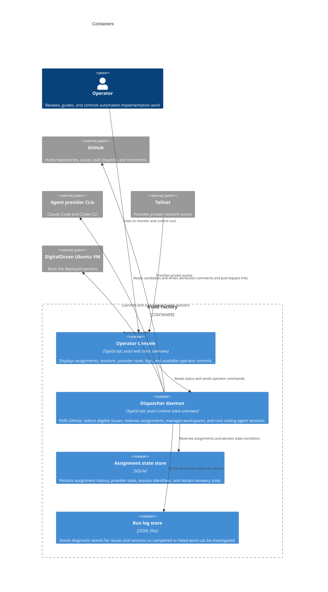
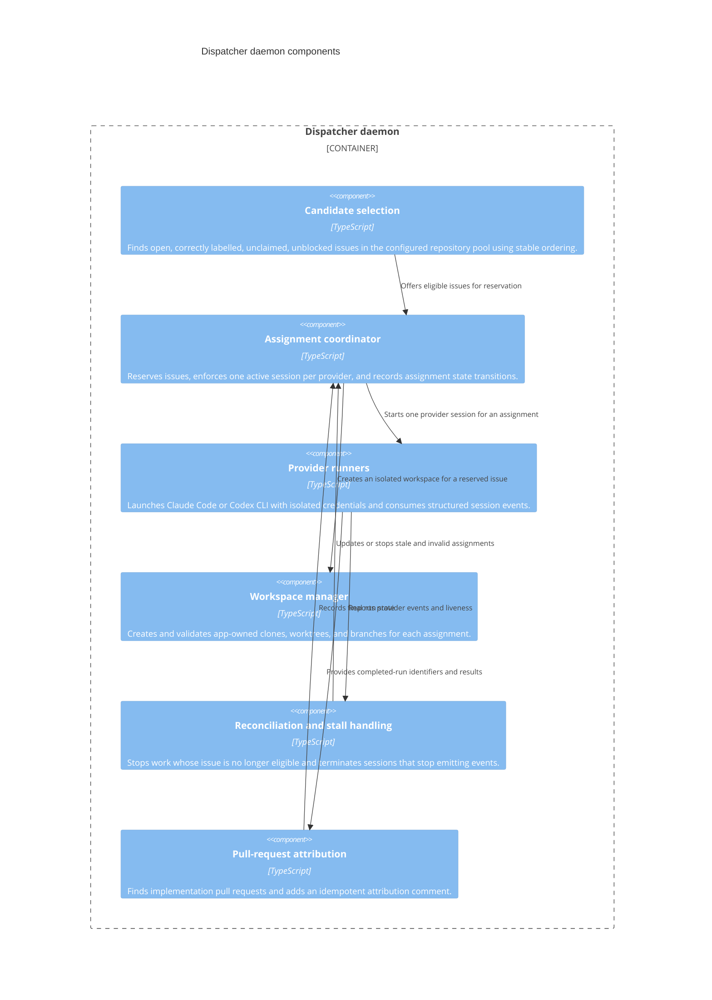
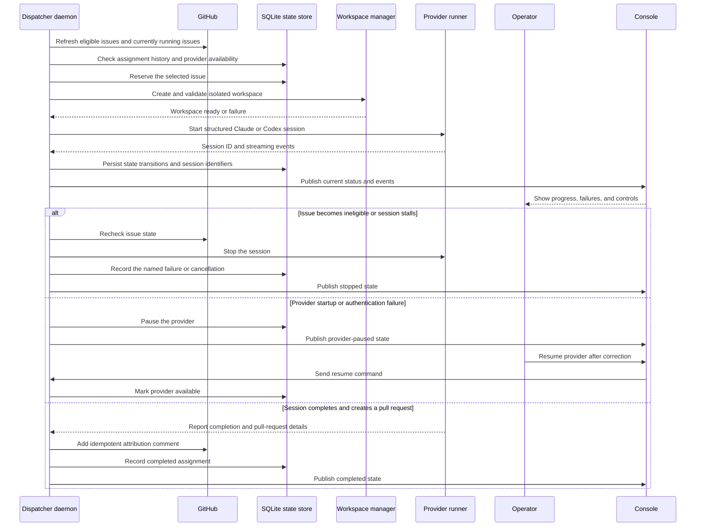

# Initial architecture: Irudd Factory agent issue dispatcher

## Current understanding

Irudd Factory is a TypeScript service hosted on one DigitalOcean Ubuntu VM. It watches configured GitHub repositories, selects eligible issues, creates isolated per-issue workspaces, and runs Claude Code or Codex CLI sessions. A tailnet-served console lets one human operator monitor sessions and control work such as pausing providers, stopping runs, resuming providers, or guiding assignments. The exact TypeScript stack and authentication details are unknown. Based on [GitHub issue #1](https://github.com/alundgren/irudd-factory/issues/1).

Each installation permanently serves one developer working on repositories
they own. The dedicated VM is the security boundary. Per-issue workspaces
separate Git state and concurrent changes, but they do not provide filesystem
read isolation from the dispatcher, provider credentials, or other workspaces.
Issues and repository contents are trusted input.

## Release requirement

Before the first real release, add `SECURITY-LIMITATIONS.md` at the repository
root. It must describe the single-user, trusted-input deployment model, the
dedicated-VM requirement, unrestricted agent reads on that VM, credentials and
network access available to agents, possible cross-workspace interference, and
the operator's responsibility for repository access and recovery. Release work
must not close this requirement by relying only on setup documentation or a
README warning.

## System context

## Containers

## Components

## Sequence

## Material unresolved questions

- What authentication mechanism should protect the console in addition to tailnet access?
- Should operator guidance be persisted as assignment instructions, sent to a live session, or limited to lifecycle controls?
- What exact durable assignment states and restart-recovery rules are required?
- What is the exact provider protocol and launch contract for Claude Code and Codex CLI?
- What console data must remain available after JSONL logs or workspaces are archived?
- What TypeScript runtime, web framework, and process supervision approach will be selected?
- Will the VM run the console and dispatcher as separate daemons or as processes managed by one service unit?
