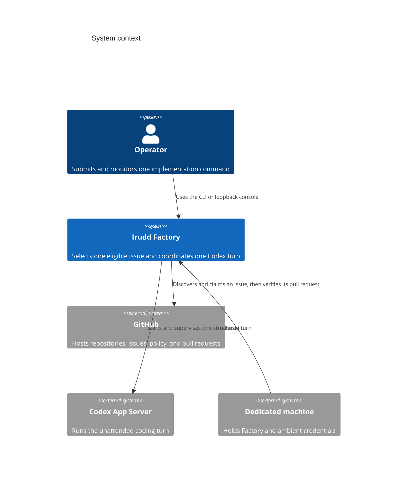
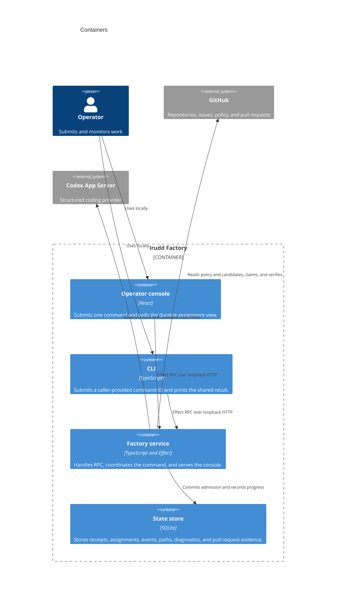
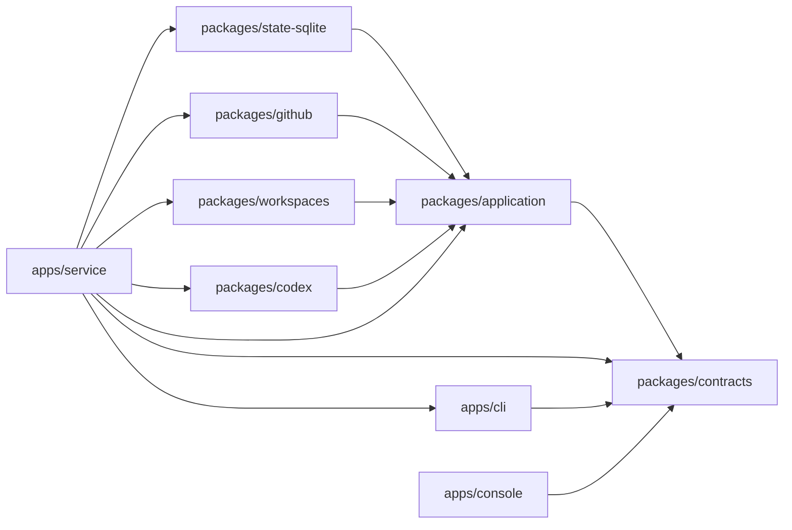
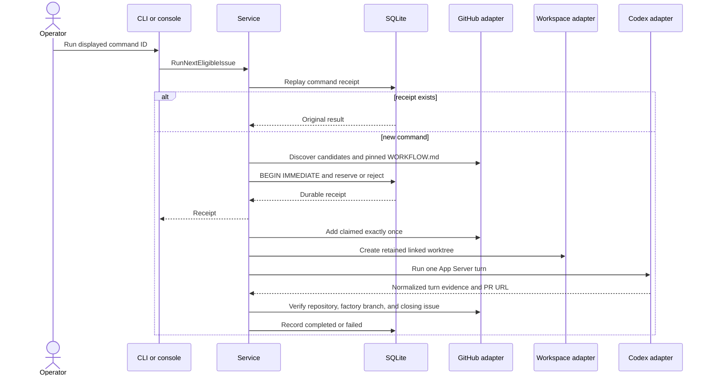

# Architecture: implemented dispatcher slice

Irudd Factory is a TypeScript service for one dedicated machine. An operator
sends a durable manual command for one configured GitHub repository. Factory
selects one eligible issue, creates a retained linked worktree, and runs one
Codex turn. A loopback-only console monitors that work.

Codex CLI is the only provider. Application ports keep its protocol out of the
command and state modules.

Three rules apply throughout the implementation:

- Only issues whose author has write permission to the repository are eligible.
- `gh` and Codex use the operator's ambient credentials. Factory creates,
  injects, and stores no tokens.
- Codex writable roots name the worktree, the linked-worktree Git directory,
  and the shared Git directory. Reads are unrestricted on the machine.

The practical consequences are recorded in
[SECURITY-LIMITATIONS.md](../../SECURITY-LIMITATIONS.md). Technology choices are
in [stack.md](../stack.md).

## System context

## Containers

## Package dependencies

`packages/application` owns command admission, state transitions, policy
parsing, prompt construction, and ports. Adapters depend on those ports.
`apps/service` owns the deterministic fixture catalog and composes production,
integration, or fixture dependencies. Each fixture definition contains its
metadata, state, fake behavior, and executable expectations. The integration
runner uses the public CLI package for the same RPC calls operators use. Neither
client imports an adapter or the application package.

`scripts/fixture.ts` is the stable development entry point. The `vp run fixture`
task is intended for interactive use. Scripts and agents invoke it through
`vp node scripts/fixture.ts` so JSON stdout contains no task-runner diagnostics.

## Command lifecycle

Polling, automatic nonterminal recovery, queues, cancellation, stall detection,
authentication, remote access, attribution comments, and cleanup are not in the
current component set.
