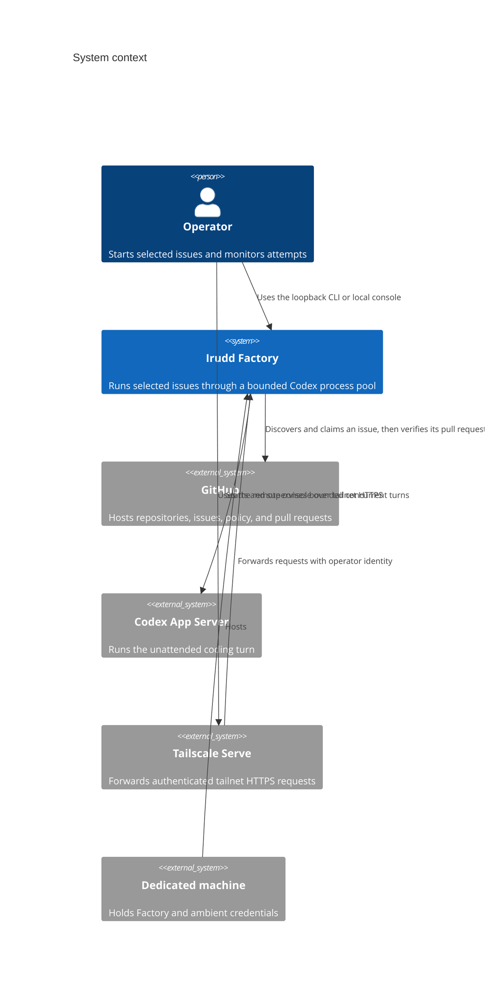
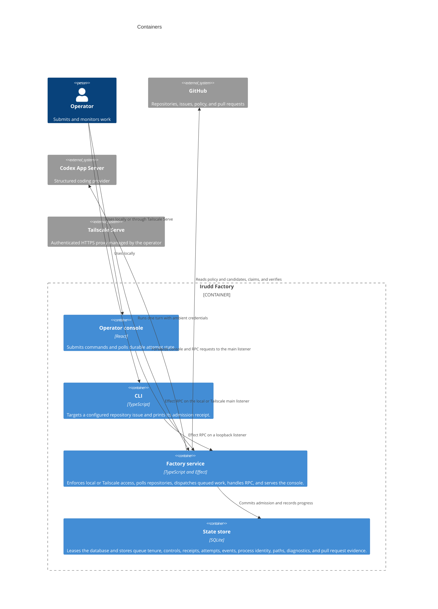
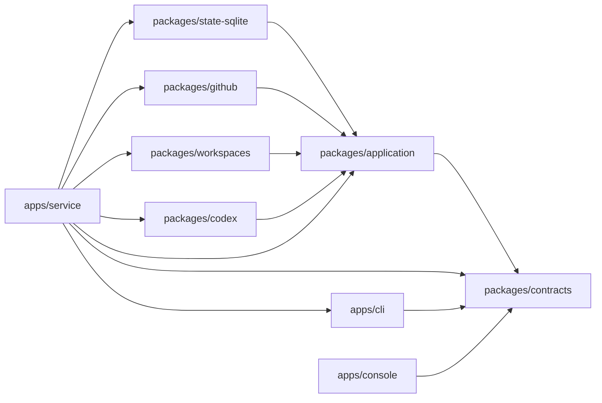
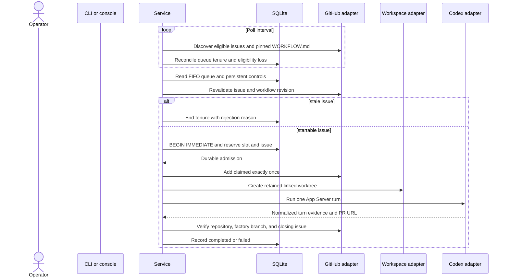

# Architecture: implemented dispatcher slice

Irudd Factory is a TypeScript service for one dedicated machine. It polls each
configured GitHub repository, records FIFO eligibility tenure, and fills a
bounded Codex pool. Factory revalidates each issue, reserves a slot, creates a
retained linked worktree, and runs one Codex turn. Manual starts use the same
admission transaction. A loopback-only listener serves the console in local
mode. Tailscale mode serves the same console through Tailscale Serve and keeps
CLI RPC on a separate loopback listener. The service exposes queue pages and
durable dispatch controls through Effect RPC.

One service process holds an exclusive lease for each database. Startup marks
unfinished attempts interrupted, terminates provider process groups whose
identity it can confirm, and keeps capacity occupied when ownership is
uncertain.

Codex CLI is the only provider. Application ports keep its protocol out of the
command and state modules.

Three rules apply throughout the implementation:

- Only issues whose author has write permission to the repository are eligible.
- `gh` and Codex use the operator's ambient credentials. Factory creates,
  injects, and stores no tokens.
- Codex writable roots name the worktree, the linked-worktree Git directory,
  and the shared Git directory. Reads are unrestricted on the machine.

The practical consequences are recorded in
[SECURITY-LIMITATIONS.md](../../SECURITY-LIMITATIONS.md). Technology choices are
in [stack.md](../stack.md).

## System context

## Containers

## Package dependencies

`packages/application` owns command admission, state transitions, policy
parsing, prompt construction, and ports. Adapters depend on those ports.
`apps/service` owns the deterministic fixture catalog and composes production,
integration, or fixture dependencies. Each fixture definition contains its
metadata, state, fake behavior, and executable expectations. The integration
runner uses the public CLI package for the same RPC calls operators use. Neither
client imports an adapter or the application package.

`scripts/fixture.ts` is the stable development entry point. The `vp run fixture`
task is intended for interactive use. Scripts and agents invoke it through
`vp node scripts/fixture.ts` so JSON stdout contains no task-runner diagnostics.

## Dispatch lifecycle

Automatic resume or retry, cancellation, stall detection, attribution comments,
and cleanup are not in the current component set. Factory validates Tailscale
identity headers but does not install, configure, start, or stop Tailscale.
